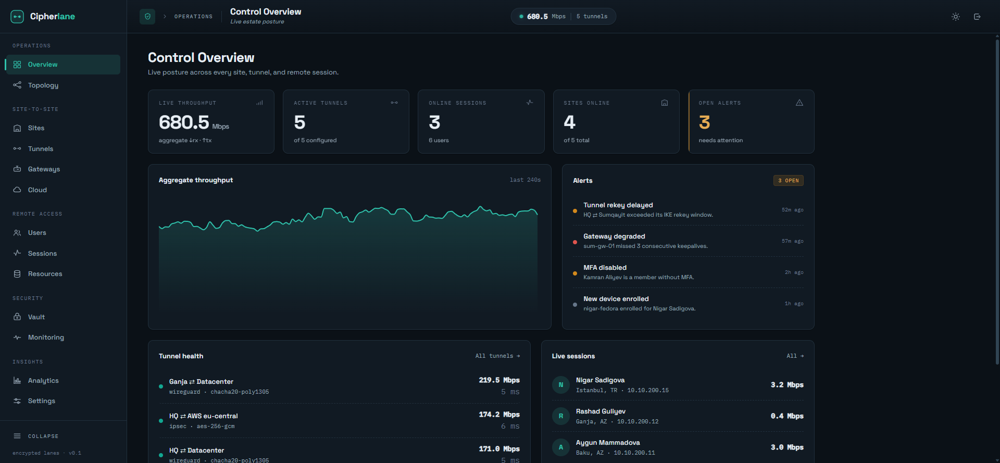
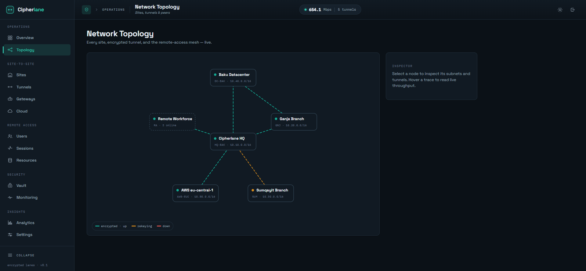

# Cipherlane

**An encrypted express lane for your networks.** Cipherlane is a modern VPN
orchestration & monitoring control plane — build, manage, and observe
**Site-to-Site** and **Remote Access** VPNs from one console, with a live
schematic topology and real-time telemetry.




---

## What it is

Cipherlane is the **management brain** that sits on top of proven VPN data-plane
technologies (WireGuard and IPsec/strongSwan) and makes them usable, observable,
and policy-driven. It **models** your network, **generates** deployable tunnel
configs, **streams** live telemetry over WebSocket, and **enforces** who can
reach what — all from a single, opinionated dashboard.

> **Reality level:** ships as an orchestration + realistic simulation engine, so
> the whole product is demonstrable end-to-end without touching the host OS. An
> optional gateway agent can apply the generated configs for real.

## Features

### Site-to-Site
- Sites (HQ, branch, datacenter, cloud VPC), gateways, and subnets on one overlay
- Encrypted tunnels — **IPsec/IKEv2** or **WireGuard**, AES-256-GCM / ChaCha20-Poly1305
- Static or dynamic (BGP/OSPF) routing, Always-On, deployable config generation
- Cloud connectors for AWS · Azure · GCP
- **Live schematic topology** with animated encrypted traces colored by health

### Remote Access
- Users, groups, and per-device enrollment (WireGuard / IKEv2 profiles + QR)
- Username/password + certificate + **MFA (TOTP)**, full vs split tunnel
- Internal resources (RDP, SSH, databases, web apps, mail, printers) and access policies
- Live session monitoring with force-disconnect

### Operations
- Real-time throughput charts and per-tunnel telemetry (handshake, rekey, latency, loss)
- Alerts, a live event stream, and a full audit trail
- AES-256-GCM secret vault (certificates, WireGuard keys, PSKs)
- Two first-class themes — light *engineering paper* and dark *night drafting table*



## Tech stack

| Layer | Technology |
|-------|-----------|
| **Control plane** |  `net/http` · chi · gorilla/websocket |
| **Storage** |  WAL mode, pure-Go driver (modernc) |
| **Dashboard** |    |
| **Visuals** | Recharts · Framer Motion · custom SVG topology |
| **Type** | Space Grotesk · IBM Plex Mono (self-hosted) |
| **Security** | AES-256-GCM vault · bcrypt passcode · HMAC session cookie |

## Architecture

Three planes:

- **Control plane** (`server/`, Go) — REST + WebSocket API, SQLite store, config
  generation, policy, audit log, and the encrypted vault.
- **Data plane** — gateways (site-to-site) and devices (remote access), managed
  via generated configs; a built-in engine streams live telemetry.
- **Presentation** (`web/`, React) — topology map, live dashboards, resizeable
  tables, wizards, and policy editors.

## Getting started

**Prerequisites:** Go 1.26+ and Node 20+.

```bash
# 1) Control plane (API + WebSocket on :7820)
cd server
go run .

# 2) Dashboard (dev server on :7821, proxies /api + /ws to :7820)
cd web
npm install
npm run dev
```

Open **http://localhost:7821** and sign in with the default passcode
**`cipherlane`**.

### Single-binary production build

```bash
cd web && npm run build        # emits web/dist
cd ../server && go run .        # serves web/dist + API on :7820
```

Open **http://localhost:7820**.

### Gateway agent (optional)

Run the agent on a Linux gateway to apply the generated WireGuard config and
stream real interface counters back to the control plane:

```bash
cd server
go build -o cipherlane-agent ./cmd/agent
./cipherlane-agent -server http://<control-plane>:7820 \
  -token <agent-token> -gateway gw_hq -iface wg0
```

Copy the token from **Settings → Gateway agent**. On non-Linux hosts the agent
runs in `-dry-run` mode and synthesizes counters so the loop can be exercised.

### Testing

```bash
cd server && go test ./...     # Go unit + integration tests
cd web && npm test             # Vitest unit tests
cd web && npm run test:e2e     # Playwright E2E (server must be running)
```

### Configuration

| Variable | Default | Purpose |
|----------|---------|---------|
| `CIPHERLANE_ADDR` | `:7820` | Listen address |
| `CIPHERLANE_PASSCODE` | `cipherlane` | Operator passcode (hashed on first boot) |
| `CIPHERLANE_DATA` | `data` | Directory for the DB and keys (git-ignored) |
| `CIPHERLANE_WEB` | `../web/dist` | Built dashboard to serve in production |
| `CIPHERLANE_DEV` | `1` | Relaxes CORS for the Vite dev server |

## Project structure

```
cipherlane/
├── server/                 # Go control plane
│   ├── main.go
│   └── internal/
│       ├── api/            # chi router + REST/WS handlers
│       ├── db/             # SQLite store, schema, seed
│       ├── sim/            # live telemetry engine
│       ├── ws/             # WebSocket broadcast hub
│       ├── vault/          # AES-256-GCM secret vault
│       └── auth/           # passcode + HMAC session
├── web/                    # React 19 + Vite dashboard
│   └── src/{components,pages,lib,hooks,styles}
└── docs/CONCEPT.md         # full product specification
```

## Security

- Secrets sealed with **AES-256-GCM**; the master key is generated on first boot
  (`data/.vault-key`, mode 0600) and never committed.
- **bcrypt** passcode + **HMAC-SHA256** session cookie (HttpOnly).
- Parameterized SQLite everywhere; auth-gated API; same-origin WebSocket in production.
- `data/` and any `.env` files are git-ignored by default.

## License

Licensed under the [Apache License 2.0](LICENSE).
